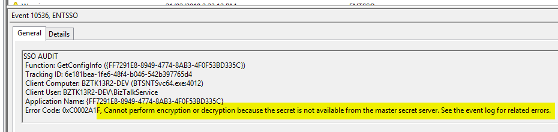

# How to reset your SSO secret

If you are getting many errors in the EventLog related to the SSO like this. _(you will also have issues deploying or viewing the SSO data)_:
```
Cannot perform encryption or decryption because the secret is not available from the master secret server. 
```



Then you need to reset your SSO master secret.

## Process

Open an admin command prompt

Change directory to `C:\Program Files\Common Files\Enterprise Single Sign-On`

Look for any `*.bak` in the folder to get the current backup of the secret.
It should be something like `SSO478AD.bak`

Then enter the command: `ssoconfig -restoresecret SSO478AD.bak`

You should see output like this:
```
Password reminder : <your reminder here>
Password : *******
The operation completed successfully.
```

## Alternatives

If you can't find any `*.bak` file in the folder or you don't recall what your password is, then unfortunately you have no choice but to un-configure and reconfigure BizTalk. 

So some tips are: **ALWAYS** backup the secret and make the Password Reminder **REALLY** obvious.

