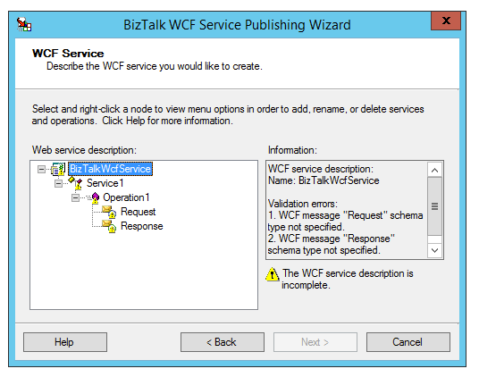

# How to re-create IIS Virtual Directories

When creating Virtual Directories for BizTalk solutions with HTTP front end, the **BizTalk WCF Service Publishing Wizard** is used.



This is fine, but usually you will need to move the generated web site to your solution.

If you then tried to re-create the site via a [BTDF](https://biztalkdeployment.codeplex.com/) deployment, it will often fail, because the site was _already_ created by the Wizard.

Even if it is deleted and IIS restarted this can still cause issues.

One work-around is to rename the site to something else.

# How to re-create IIS Virtual Directories2
# How to re-create IIS Virtual Directories3
Or you can delete this file:

```
c:\windows\system32\inetsrv\config\applicationhost.config
```