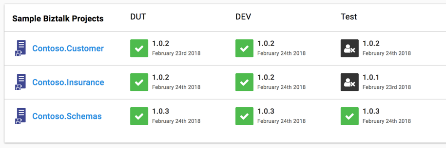

# How to update the deployment state in Octopus

## The issue

There is now the ability to change the state of a deployment after its happened.

This can be useful if there are scenarios where external apps can remove deployments triggered from Octopus, and you want a way to let Octopus know that an app is no longer there.

A good example of this is BizTalk deployments where an app getting deployed will remove other applications that are dependant on it.

## Process

Get the Server-Task Id from the Deployment record

then run the following _\(obviously alter it a bit based on your needs\)_ :

```text
$apikey = 'APIHFHFHFHFHFHFHFHFH'
$header = @{"X-Octopus-ApiKey"=$apikey}

$serverTaskId = 'ServerTasks-1638'
$octopusUri = "https://$instanceName.octopus.com/api/tasks/$serverTaskId/state"

$data = @{state='Failed'; reason='Application was removed as part of installation of Contoso.Schemas.'}
$body = $data | ConvertTo-Json

Invoke-RestMethod -Method Post -Uri $octopusUri  -Body $body -Headers $header
```

This will update the status. Example shown below:



