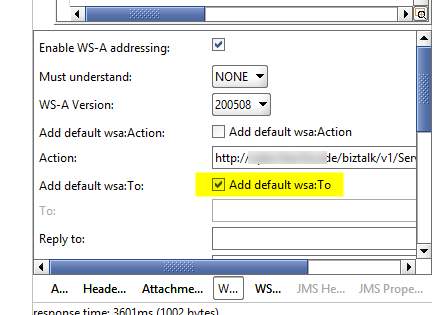

# How to configure SoapUI for WCF-WSHttp messages

[SOAP UI](http://www.soapui.org) is a pretty good tool for manually sending mocked messages to BizTalk WCF-WSHttp endpoints.

Just have to remember to tick this option:



Before you send your message otherwise you will end up with errors like:

```markup
<s:Envelope xmlns:s="http://www.w3.org/2003/05/soap-envelope" xmlns:a="http://www.w3.org/2005/08/addressing">
   <s:Header>
      <a:Action s:mustUnderstand="1">http://www.w3.org/2005/08/addressing/soap/fault</a:Action>
   </s:Header>
   <s:Body>
      <s:Fault>
         <s:Code>
            <s:Value>s:Sender</s:Value>
            <s:Subcode>
               <s:Value>a:DestinationUnreachable</s:Value>
            </s:Subcode>
         </s:Code>
         <s:Reason>
            <s:Text xml:lang="en-AU">The message with To '' cannot be processed at the receiver, due to an AddressFilter mismatch at the EndpointDispatcher.  Check that the sender and receiver's EndpointAddresses agree.</s:Text>
         </s:Reason>
      </s:Fault>
   </s:Body>
</s:Envelope>
```

